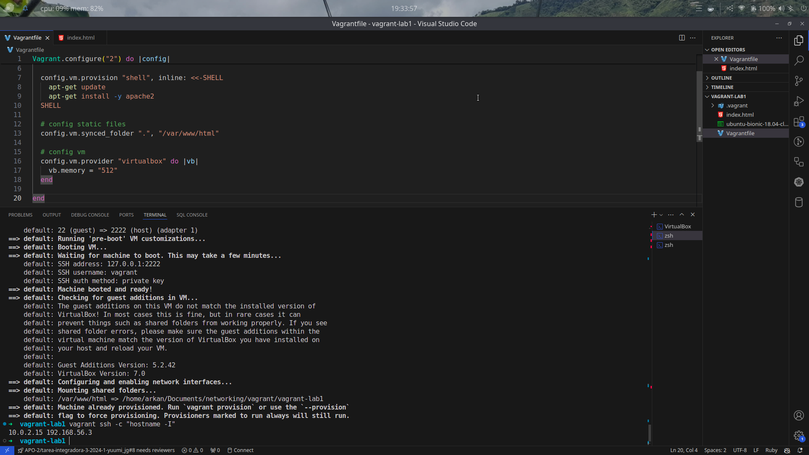

# Vagrant Lab 1

En este lab se crea una máquina virtual con Vagrant y se instala un servidor web Apache para servir una sencilla página en html.

## Requisitos

- Vagrant
- VirtualBox

## Procedimiento

1. Crear un directorio para el proyecto y entrar en él.

2. Crear un archivo `Vagrantfile` que configure una VM con las siguientes características:
  - Sistema operativo Ubuntu 24.04 (noble).
  - 0.5 GB de memoria RAM.
  - Red privada con IP dinámica (DHCP).

> Exactamente como el que hay [aquí](Vagrantfile).

3. Iniciar la máquina virtual con el comando `vagrant up`.

4. Salir de la máquina virtual con el comando `exit`.

5. Obtener la dirección IP con `vagrant ssh -c hostname -I`. Debe verse como algo así:

6. Acceder a la página web desde el navegador en la dirección `http://[ip de la máquina]`.

Y esta será la página que se verá:

7. Parar la máquina virtual con el comando `vagrant halt`.